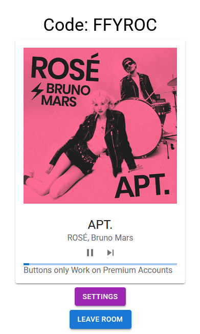

# About This Project

This project is based on tutorial from Tech with Tim Tutorial (https://github.com/techwithtim/Music-Controller-Web-App-Tutorial).

## Setup

You will first need to go to spotify [developer website](https://developer.spotify.com/dashboard) and create an API credential, then add the information:

```
File at: project_react_django_spotify/spotify/credentials.py

CLIENT_ID = "client ID"
CLIENT_SECRET = "Your Secret (DO NOT SHARE)"
```

## Start React and Django:

To Run the Django Server:

```
cd project_react_django_spotify
python manage.py runserver
```

To Run React (make sure you have react install):

```
cd project_react_django_spotify/frontend
npm run dev
```

**NOTE:** both react and django server must be running together.

## About the interface:

Now that you have start your local server, you can go to the ip: [127.0.0.1:8000](http://127.0.0.1:8000), which is your local host.

From there you can create a room, and synch with your spotify account.



At the time of create this project, the play, skip, and pause buttons no longer work as the API only allows premium accounts to send these request. If you are a premium account, feel free to test it.
